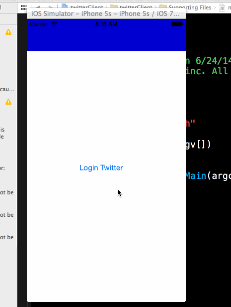

twitter
========
Twitter iOS Demo App

Overview: Build a simple Twitter client that supports viewing a Twitter timeline and composing a new tweet.

Time spent: approximately 18 hours

Features
---------
#### Required
- [x] User can sign in using OAuth login flow
- [x] User can view last 20 tweets from their home timeline
- [x] The current signed in user will be persisted across restarts
- [x] In the home timeline, user can view tweet with the user profile picture, username, tweet text, and timestamp.
- [x] User can pull to refresh
- [x] User can compose a new tweet by tapping on a compose button.
- [x] User can tap on a tweet to view it, with controls to retweet, favorite, and reply.

#### Optional
- [ ] When composing, you should have a countdown in the upper right for the tweet limit.
- [ ] After creating a new tweet, a user should be able to view it in the timeline immediately without refetching the timeline from the network.
- [ ] Retweeting and favoriting should increment the retweet and favorite count.
- [ ] User should be able to unretweet and unfavorite and should decrement the retweet and favorite count.
- [ ] Replies should be prefixed with the username and the reply_id should be set when posting the tweet,
- [ ] User can load more tweets once they reach the bottom of the feed using infinite loading similar to the actual Twitter client.

Walkthrough
------------

Credits
---------
* [Twitter API](https://dev.twitter.com/docs/api/1.1)
* [Icons](http://twitter.com)

Other
-----
*[remote image loading](http://stackoverflow.com/questions/13347154/afnetworking-setimagewithurlrequest-not-setting-remote-image)

*[how to use blocks](http://www.raywenderlich.com/9438/how-to-use-blocks-in-ios-5-tutorial-part-2) 

*[twitter api](https://dev.twitter.com/docs/api/1.1)

*[nav bar class reference](https://developer.apple.com/library/ios/documentation/uikit/reference/uinavigationbar_class/Reference/UINavigationBar.html)

  
